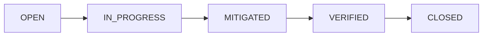

# Vulnerability Index

**Last Updated**: 2025-11-30
**Total Vulnerabilities**: 0 (awaiting first scan)

---

## Status

⏳ **No vulnerabilities documented yet**

To generate vulnerability docs, ask the `security-audit-specialist` agent:

```bash
"Generate security baseline"
```

The agent will create individual vulnerability documents for each CRITICAL and HIGH priority issue found.

---

## Vulnerability Naming Convention

**Format**: `VULN-XXX-short-description.md`

**Examples**:
- `VULN-001-missing-rate-limiting.md`
- `VULN-002-plaintext-api-tokens.md`
- `VULN-003-exposed-docker-ports.md`

---

## Expected Vulnerabilities (From Research)

Based on code exploration, these vulnerabilities are likely to be found:

### Critical Issues
1. **Missing Rate Limiting** - Auth routes, booking endpoint
2. **Exposed Docker Ports** - MySQL 3306, Redis 6379
3. **Plaintext API Tokens** - Email SMTP, SMS API keys

### High Priority Issues
4. **Mass Assignment** - User model has 40+ fillable fields
5. **No Webhook Signatures** - SMS API callbacks not verified

### Medium Priority Issues
6. **Session Encryption Disabled** - `SESSION_ENCRYPT=false`
7. **No 2FA** - Admin accounts lack two-factor authentication
8. **Missing Security Headers** - CSP, HSTS, X-Frame-Options

---

## Vulnerability Template

Each vulnerability doc follows this structure:

```markdown
# VULN-XXX: [Title]

**Severity**: CRITICAL | HIGH | MEDIUM | LOW
**Status**: OPEN | IN_PROGRESS | MITIGATED
**Discovered**: YYYY-MM-DD
**OWASP**: A0X:2021 - [Category]

## Summary
Brief description

## Impact
- Consequence 1
- Consequence 2

## Affected Components
- File: path/to/file.php:line
- Route: POST /endpoint

## Detection Command
```bash
grep -rn "pattern" app/
```

## Remediation
See: [remediation-guides/guide-name.md](../remediation-guides/guide-name.md)

## Code Example
**Before (Vulnerable)**:
```php
// Vulnerable code
```

**After (Secure)**:
```php
// Secure code
```

## Validation
```bash
# Test command
```
```

---

## Creating New Vulnerabilities

### Manually

```bash
# Ask the security agent
"Create vulnerability doc for [issue description]"

# Agent will:
# 1. Assign next VULN-XXX number
# 2. Assess severity
# 3. Create vulnerability doc
# 4. Update this README.md
```

### Automatically (During Scan)

When you run `"Generate security baseline"`, the agent automatically creates vulnerability docs for all CRITICAL and HIGH priority findings.

---

## Vulnerability Lifecycle



1. **OPEN** - Vulnerability discovered
2. **IN_PROGRESS** - Fix being implemented
3. **MITIGATED** - Fix deployed
4. **VERIFIED** - Security agent re-scanned, confirmed fixed
5. **CLOSED** - Archived (optional, can keep as MITIGATED)

---

**Next Step**: Ask agent to generate security baseline
